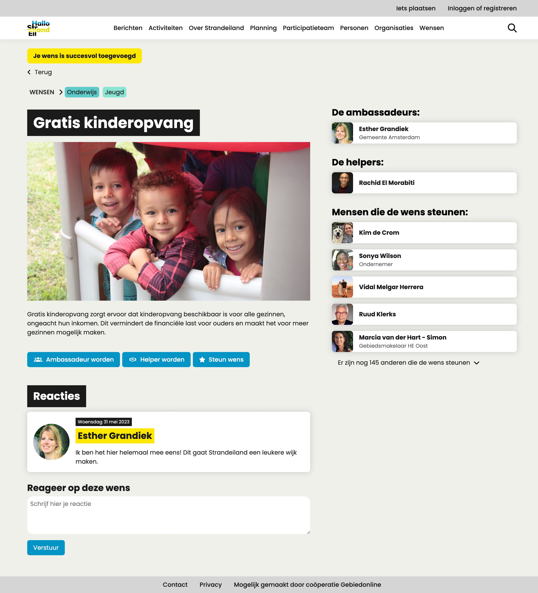
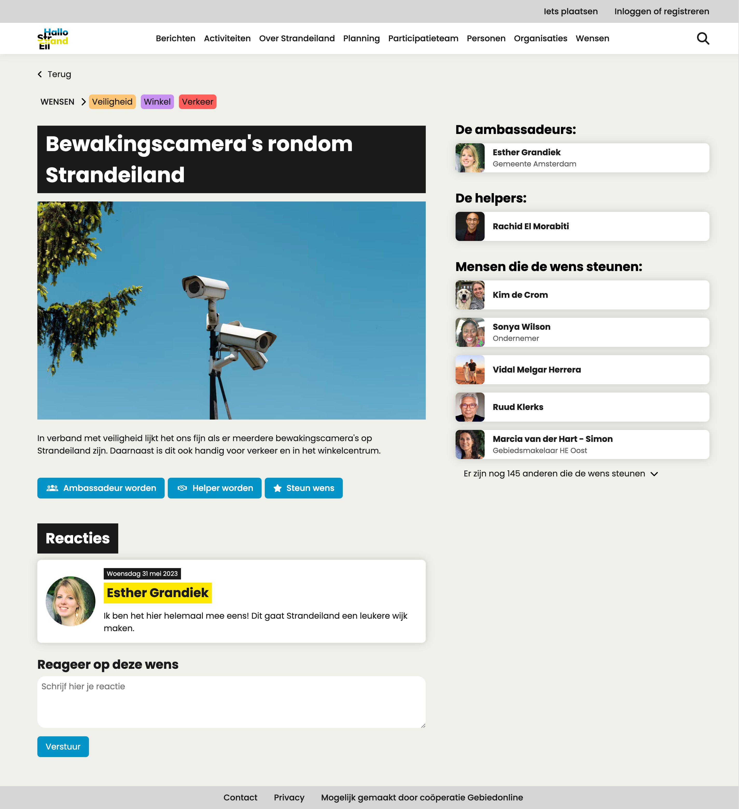
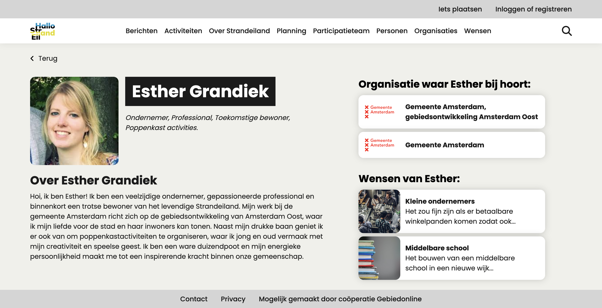

# Hallo-Strandeiland

Op het moment is er al een groot stuk grond aangelegd voor de nieuwe wijk Strandeiland dat bij IJburg gaat horen. De gemeente Amsterdam wil graag dat de bevolking gaat meedenken over de invulling van deze nieuwe wijk. Daarom hebben wij (Pip en Ine) een functionaliteit voor de website Hallo Strandeiland gemaakt waarop bewoners hun ideeën kunnen delen.

De link naar onze live prototype: https://hallo-strandeiland.adaptable.app/


## Inhoudsopgave

- [Case](#case)
- [User Stories](#user-stories)
- [De debriefing](#de-debriefing)
- [Probleemdefinitie](#probleemdefinitie)
- [Oplossing](#oplossing)
- [Uitleg code](#uitleg-code)
- [Hoe installeer je dit project?](#hoe-installeer-je-dit-project)
- [Hoe gebruik je dit project?](#hoe-gebruik-je-dit-project)
- [Waar maken we gebruik van?](#waar-maken-we-gebruik-van)
- [Wishlist](#wishlist)
- [Bronnen](#bronnen)

## Case

Het participatieteam van de Gemeente Amsterdam wil graag dat de mensen mee gaan denken over de nieuwe wijk Strandeiland bij IJburg. Daarom willen zij graag aan de website https://hallostrandeiland.nl/ een nieuwe functionaliteit toevoegen, waar wensen ingestuurd kunnen worden om van Strandeiland een duurzameme en sociale wijk te maken. De gebruikers van de website moeten reacties op de wensen kunnen plaatsen en kunnen aangeven of ze de wens willen steunen, helpen of ambassadeur willen worden van de wens. De wensen moeten in een overzicht geplaatst worden en de gebruikers moeten kunnen filteren op thema.

## User Stories

1. Als toekomstig bewoner, wil ik mijn voorstel voor een duurzamer, groener en socialer strandeiland kunnen delen, zodat dit onderzocht en hopelijk gerealiseerd kan worden.

2. Als toekomstig bewoner, wil ik een reactie kunnen geven op voorstellen van andere toekomstige bewoners, zodat we kunnen samenwerken aan het vormgeven van de voorstellen.

3. Als projectmanager van de gemeente, wil ik voorstellen van toekomstige bewoners kunnen filteren op thema's, zodat ik per thema kan bekijken of er ideeën bijzitten die kunnen bijdragen aan een lagere ecologische footprint, of betere sociale cohesie van de wijk.

## De debriefing

### Contactgegevens

**CrossmarX**

Opdrachtgever: Michel Vogler

Tel: +31654771927

Datum aanvraag: 30-05-2023

Datum oplevering: 29-06-2023

### Achtergrondinformatie

De opdrachtgever is Michel Vogler van CrossmarX. Michel is sinds 2009 bewoner van IJburg en is oprichter van CrossmarX. Voor IJburg heeft hij het platform halloijburg.nl opgericht, omdat hij merkte dat IJburg verdeeld was in de rijkere en de wat armere groep. Om deze kloof op te lossen en de middenklasse ook meer te betrekken bij de ontwikkelingen in de wijk heeft hij dit initiatief genomen.

CrossmarX is een Amsterdams softwarebedrijf dat als missie heeft om automatiseringsprocessen eenvoudiger te maken, vooral voor de sectoren zorg, cultuur, onderwijs, en non-profit dienstverlening.

Het CrossmarX application platform maakt gebruik van een "low code approach" en bevat alle veel voorkomende functionaliteiten voor bedrijfsapplicaties, denk hierbij aan gegevens in een database opslaan en uitlezen, verschillende autorisaties instellen, berekeningen en formules definiëren, of workflow-procedures specificeren. Gebruikers kunnen de gewenste functionaliteit activeren en specificeren zonder dat er programmeerwerk nodig is. Door middel van hun “low-code approach” kunnen wijzigingen in de applicatie onwijs snel doorgevoerd worden.

Vanwege de flexibiliteit, snelheid, ontwikkelkracht en stabiliteit heeft CrossmarX drie keer op rij de Rapid Application Development Race gewonnen, namelijk in 2006, 2007 en 2008. Het drie keer winnen van de RAD Race is nog niet eerder gebeurd en heeft er ook voor gezorgd dat CrossmarX een stabiele marktpositie heeft kunnen behalen.

### Opdrachtomschrijving

CrossmarX wil graag een functionaliteit waar toekomstige bewoners tips en wensen voor de nieuwe wijk Strandeiland toe kunnen voegen aan de al bestaande website https://hallostrandeiland.nl/, om de communicatie tussen de gemeente Amsterdam en de toekomstige bewoners van Strandeiland te verbeteren. Deze ideeën, tips en wensen moeten aan een thema gekoppeld kunnen worden, zodat er gefilterd kan worden. Andere gebruikers moeten ook op de verschillende voorstellen kunnen reageren, zodat er discussies kunnen ontstaan over de verschillende wensen.

### Aanleiding

Strandeiland wordt het op een na laatste nieuwe wijk van IJburg. Vanaf 2025 gaan ze beginnen met het bouwen van de 8000 woningen. Sinds 2018 zijn ze al bezig met het maken van het eiland. Op het moment ligt het eiland er en moeten ze wachten tot het zand is ingezakt. De gemeente Amsterdam wil dit eiland samen met de toekomstige bewoners en buurtbewoners van IJburg gaan maken. Daarom moet er een nieuwe functionaliteit komen op hallostrandeiland.nl waar mensen hun ideeën, tips en wensen kwijt kunnen, om zo van Strandeiland een leuke woon-, werk- en recreatiewijk te maken.

### Doelstelling

Het doel van CrossmarX is om de huidige bewoners van IJburg en de toekomstige bewoners van de nieuwe wijk van IJburg, Strandeiland en de gemeente Amsterdam samen te brengen. Met dit doel willen ze ervoor zorgen dat de nieuwe wijk Strandeiland een fijn woon, werk en recreatie eiland wordt.

### Oplevering

Op 29 juni gaan wij naar het kantoor van CrossmarX en zullen wij de nieuwe wensen-functionaliteit opleveren en presenteren voor de website hallostrandeiland.nl. Deze functionaliteit gaan we bouwen met HTML, CSS en JavaScript wat tot een klikbaar prototype zal gaan leiden. De wensen-functionaliteit houdt in dat gebruikers een voorstel kunnen doen voor de toekomstige inrichting van Strandeiland, waar andere toekomstige bewoners en de projectmanager van de gemeente op kunnen reageren. Het is belangrijk dat de ideeënbus overzichtelijk en gestructureerd wordt door alle wensen in te delen in thema’s. Ook moet er een oplossing komen zodat dubbele wensen voorkomen worden.

Deze functionaliteit zal mogelijk in de toekomst echt onderdeel worden van hallostrandeiland.nl, waardoor het belangrijk is dat de huisstijl van deze website wordt overgenomen in de nieuwe functionaliteit. Verder is het nog belangrijk dat het project voldoet aan de hieronder opgestelde randvoorwaarden.

De code van onze functionaliteit is volledig in te zien op onze github repository, waar ook de documentatie over onze gedachtegang en proces te lezen is.

### Randvoorwaarden

De aankomende vijf weken gaan wij voor de opdrachtgever werken aan een klikbaar prototype, deze gaan wij bouwen met HTML, CSS en JavaScript. Om tot het beste eindresultaat te komen hebben wij een aantal randvoorwaarden opgesteld:

**Wat gaan we niet maken:**

- We gaan niet de volledige website van https://hallostrandeiland.nl/ opnieuw bouwen.
- Er hoeft in principe geen inlogfunctionaliteit gemaakt te worden.
- De functionaliteit moet niet op de gemeente gericht worden.

**Waar moet het project aan voldoen:**

- Gebruikers moeten met de functionaliteit nieuwe ideeën, wensen of tips kunnen toevoegen aan de website.
- Gebruikers moeten deze nieuwe ideeën, wensen of tips aan een thema kunnen koppelen.
- Gebruikers moeten op elkaars ideeën, wensen of tips kunnen reageren.
- Het ontwerp moet voldoen aan het brandbook gemaakt door de gemeente Amsterdam.
- De functionaliteit moet de samenwerking tussen alle betrokken partijen bevorderen.
- De functionaliteit moet het samenkomen van verschillende bevolkingsgroepen bevorderen.
- De functionaliteit moet voorkomen dat meerdere mensen hetzelfde idee/wens/tip insturen.
- De website moet live staan, zodat de opdrachtgever deze kan testen en bekijken.

**Wat hebben wij nodig om te kunnen starten:**

- We hebben toegang tot de API nodig.
- We het brandbook gemaakt door de gemeente Amsterdam nodig

**De systemen, technieken en expertises die wij nodig zijn:**

- Expertise op het gebied van design.
- Expertise op het gebied van development (HTML, CSS, JS).
- Het systeem dat we nodig hebben is GitHub.
- We hebben expertise nodig van onze coach, voor wanneer we vastlopen.
- We hebben expertise nodig over de API die we gaan gebruiken.
- We hebben expertise nodig van andere docenten over ons gemaakte design en geschreven code.

**De planning van het project is:**

Elke week een afspraak gemaakt met de opdrachtgever om onze nieuwe iteratie te presenteren. We hebben nog geen exacte tijden afgesproken, omdat de opdrachtgever dit liever kort van tevoren doet via Whatsapp. De data van onze afspraken zijn als volgt.

| Data                    | Planning                                                                                                        |
| ----------------------- | --------------------------------------------------------------------------------------------------------------- |
| Week 1: 30-05 tot 02-06 | Dinsdag: Kickoff en briefing met opdrachtgever </br> Vrijdag: Om 13:00 iteratie 1 presenteren aan opdrachtgever |
| Week 2: 05-06 tot 09-06 | Vrijdag: Iteratie 2 presenteren aan opdrachtgever                                                               |
| Week 3: 12-06 tot 16-06 | Vrijdag: Iteratie 3 presenteren aan opdrachtgever                                                               |
| Week 4: 19-06 tot 23-06 | Vrijdag: Iteratie 4 presenteren aan opdrachtgever                                                               |
| Week 5: 06-06 tot 30-06 | Donderdag: Final prototype presenteren aan opdrachtgever                                                        |

### Gebruikers van het eindresultaat

De functionaliteit die wij gaan maken is bedoeld voor mensen met goede ideeën, tips en wensen voor de nieuwe wijk Strandeiland. Dit kunnen mensen zijn die er in de toekomst willen gaan wonen, in de buurt wonen of een goed idee/tip hebben. Met deze ideeën, tips en wensen willen zij van Strandeiland een duurzame, sociaal en fijne leefomgeving maken.

De website gaat het meest gebruikt worden door de mensen die al in IJburg wonen, er in de toekomst gaan wonen en door de gemeente Amsterdam om mee te kijken met wat zij kunnen doen met de gegeven ideeën, tips en wensen. Al deze ideeën, tips en wensen zijn suggesties en de gemeente Amsterdam is niet verplicht om er wat mee te doen. Buurtbewoners kunnen ook kijken of zij gezamenlijk wat met suggesties kunnen doen.

De buurtbewoners helpen graag mee met wat er met de nieuwe wijk gaat gebeuren, om er op deze manier een zo duurzaam, sociaal en fijn mogelijke leefomgeving van te maken. Dit hebben zij ook gedaan aan het begin van het opbouwen van IJburg, hiervoor had CrossmarX ook een website gemaakt halloijburg.nl. Op deze website kunnen (toekomstige) bewoners ook wensen plaatsen wat er aan IJburg moet worden toegevoegd.

### Relatie met andere projecten

De functionaliteit die wij gaan bouwen wordt onderdeel van een al bestaande website https://hallostrandeiland.nl/. Het wordt daarbij ook onderdeel van de campagne Strandeiland, omdat het geheel in de bedachte huisstijl gemaakt gaat worden die de gemeente Amsterdam heeft gemaakt voor Strandeiland.

Strandeiland heeft een relatie met https://halloijburg.nl/. En de functionaliteit die wij gaan maken is geïnspireerd op de wensen functionaliteit van halloijburg. Deze functionaliteit wordt geen koppeling naar een nieuw systeem of ander systeem, maar de functionaliteit wordt wel geïnspireerd op die van een ander systeem.

## Probleemdefinitie

Op dit moment wordt er gebouwd aan een nieuwe wijk van IJburg genaamd Strandeiland. De Gemeente Amsterdam wil dat deze wijk zo duurzaam en sociaal mogelijk wordt en wil hierbij hulp van de bevolking. Ze vinden het lastig om met verschillende bevolkingsgroepen samen te werken en een overzicht te krijgen van alle wensen.

## Oplossing

Om bovenstaande probleemdefinitie op te lossen hebben wij een nieuwe functionaliteit gemaakt voor de bestaande website https://hallostrandeiland.nl/. Met deze nieuwe functionaliteit kunnen gebruikers van de website een wens plaatsen voor de nieuwe wijk Strandeiland. Deze wensen kunnen zij koppelen aan een of meerdere thema's. Ook kunnen zij hier een link naar een afbeelding toevoegen in plaats van alleen uploaden, zodat de gebruiker makkelijker een afbeelding van een rechtenvrije website kan halen. Wanneer de wens is ingestuurd kom je op de detail pagina van de wens. Hier kunnen andere gebruikers op deze wens reageren en aangeven of ze de wens willen steunen, helpen of ambassadeur willen worden van die wens. Ook hebben we een detail pagina gemaakt van een persoon, zodat je meer informatie over deze persoon kan lezen. Op de overzichtpagina kun je alle wensen op een overzichtelijke manier bekijken en is het mogelijk voor de gebruiker om de layout te veranderen. Standaard worden de wensen in een Masonry grid weergegeven maar als je dit niet handig vindt kun je er ook voor kiezen om de wensen in een normaal grid weer te geven. Daarnaast hebben we ook een filtersysteem ontworpen, waarmee je zou kunnen filteren op één of meerdere thema's. Wij hebben helaas niet genoeg tijd gehad om deze ook helemaal werkend te maken, net als de sorteer functionaliteit.

### Wens aanmaken:

Voor het aanmaken van een wens hebben we een formulier gemaakt. In dit formulier kun je eerst checken of je wens al bestaat. Dit kun je doen door op de button zoeken door wensen te klikken. Dan opent er een dialog. We hebben gekozen voor een dialog, omdat je dan op de pagina van het formulier blijft en niet opeens ergens anders bent. Wanneer je de wens die je in gedachten hebt niet kan vinden kun je je wens aanmaken door een titel, beschrijving, een link naar een afbeelding in te vullen en een of meerdere thema's te selecteren.


<br>
In het formulier hebben we progressive enhancement toegevoegd door middel van HTML, CSS en JavaScript. Zo kun je het formulier ook gebruiken als JavaScript en/of CSS uit staat. De tekst errors worden weergegeven doormiddel van JavaScript, Het groene cirkeltje met het vinkje word met CSS weergegeven als het veld valid is. Wanneer alleen de HTML aan staat dan worden er standaard HTML error meldingen gegeven.
<br><br>
We hebben er voor gekozen om een preview van de afbeelding te laten zien wanneer de link juist is ingevuld, zodat de gebruiker de afbeelding te zien krijgt en kan controleren of de juiste afbeelding wordt toegevoegd.
<br><br>


### Detail pagina wens:

Wanneer je het formulier verstuurd, kom je meteen op de pagina van de wens die je hebt aangemaakt. Op deze manier kan de gebruiker meteen checken of alles goed is gegaan. Om goed aan te geven dat je wens is toegevoegd, komt er boven aan de pagina een melding met je wens is succesvol toegevoegd.



<br>

Wanneer je bijvoorbeeld vanaf de overzichtspagina naar een wens gaat ziet de detail pagina van de wens er zo uit en komt er geen bericht bovenaan. We hebben ervoor gekozen om op alle detail wens pagina's een button terug te plaatsen, zodat de gebruiker makkelijk terug kan gaan naar de vorige pagina. Daaronder hebben we breadcrumbs geplaatst waar de gebruiker door op wensen te klikken naar het overzicht met alle wensen gaat. Daarachter staan alle thema's het was de bedoeling om deze klikbaar te maken en dat je dan naar een pagina gaat waar je alleen de wensen met dat thema ziet in het overzicht. Helaas hebben we geen tijd meer gehad om dit ook werkent te maken.



### Overzicht wensen:
Alle aangemaakte wensen worden verzameld op de overzicht pagina, welke de gebruiker ook ziet als hij op "Wensen" klikt in de menubalk. Er zijn een aantal mogelijkheden op deze pagina om de data te beïnvloeden. Zo hebben we een filtersysteem; als de gebruiker op de filterbutton klikt klappen de filters naar beneden open en kan de gebruiker selecteren van welke thema's hij/zij de wensen wil zien. Ook kan de gebruiker sorteren op een random volgorde, nieuwste wensen, eerste wensen, meeste ambassadeurs, meeste helpers, meeste delers of meeste reacties. Naast de sorteerfunctionaliteit hebben we een zoekbalk gemaakt, zodat de gebruiker heel snel een specifieke wens kan vinden. Tot slot hebben we een layout switch geïmplementeerd, zodat de gebruiker kan kiezen tussen een masonry grid of een normaal grid. Standaard worden de wensen weergegeven in een masonry (ongelijk) grid.

<br>

Voor het maken van deze layoutswitch is rekening gehouden met browser support, zo werkt Css masonry tot nu toe alleen nog maar in Firefox (met een flag). Om wel alle gebruikers de masonry ervaring te kunnen geven, ongeacht welke browser ze gebruiken, hebben we een fallback gemaakt. Wanneer de gebruiker een browser gebruikt die geen Css masonry ondersteund, wordt er gebruik gemaakt van de JavaScript library Desandro Masonry. Deze fallback is gemaakt met behulp van de `@supports` rule. Deze rule zorgt ervoor dat de browser eerst checkt of de Css masonry wordt ondersteund. Wanneer dit niet het geval is, wordt de fallback gebruikt. Wanneer dit wel het geval is, wordt de Css masonry gebruikt.


### Detail pagina persoon:

Voor de persoon pagina hebben we gekozen voor een iets ander design. Hier hebben we ook gekozen om een terug button te plaatsen zodat als de gebruiker van bijvoorbeeld een wens pagina komt de gebruiker ook weer makkelijk terug kan gaan naar die wens. Hier hebben we gekozen om de afbeelding en de naam naast elkaar te zetten, zodat de afbeelding niet al te groot wordt weergegeven en er niet te veel witruimte omheen staat. Onder de naam hebben we geplaatst wat de persoon doet en eventueel of de gebruiker misschien een toekomstige bewoner wordt. Onder de afbeelding en naam komt dan het stukje tekst over de persoon, zodat anderen erachter kunnen komen wie die persoon nou eigenlijk is.

<br>

In de sidebar komt te staan of de gebruiker eventueel bij een organisatie of bedrijf hoort die veel voor de wijk kan betekenen. Daaronder komen de wensen die de persoon heeft aangemaakt, zodat anderen eventueel makkelijk kunnen zien wat die persoon nog meer heeft aangemaakt. We hebben ervoor gekozen om dit nog steeds in een sidebar te plaatsen zodat de gebruiker meer in een keer op de pagina kan zien.



### Extra's:

We hebben ook nog wat extra dingen uitgewerkt in figma, waar we geen tijd meer voor hadden om dit in de website te verwerken. Zo hebben we nog twee opties voor het filter uitgewerkt, opties voor als er meerdere afbeeldingen geupload zouden kunnen worden en een optie waar het formulier in twee wordt gesplitst.

#### Aantal thema's per wens:

We hebben een ontwerp gemaakt met hoe het filter eruit kan komen te zien als je graag wilt zien zien welk thema de meeste wensen gekoppeld heeft. Dit hebben we gedaan door een nummer van het aantal wensen die aan dat thema gekoppeld zijn te laten zien.


#### Filteren verticaal in een sidebar:

We kregen als feedback dat het voor de gebruiker vervelend kan zijn dat je een keer moet klikken om het filter te openen. Hier voor hebben we een ontwerpje gemaakt dat het filter naast de wensen staat, maar dan heb je wel minder wensen op een rij staan. Dit vonden wij zelf minder goed, omdat de wensen belangrijker zijn dat het filter en op deze manier zie je in een keer minder wensen dan wanneer het filter er boven zou staan met een knop om het filter te openen. Wel zou je in deze optie veel meer extra filter opties kunnen toevoegen, aangezien je naar onder meer ruimte hebt.


#### Meerdere afbeeldingen uploaden:

Wanneer er in het formulier meerdere afbeeldingen worden geupload is het handig dat er ook een ontwerpje is hoe dit dan op de website kan worden getoond. Hiervoor heb ik twee ontwerpen gemaakt voor in de wishcard. Wanneer er max twee afbeeldingen kan worden geupload kan je doormiddel van de hover de tweede afbeelding in de wishcard laten zien. Dat er iets gebeurd op hover geeft ook aan dat je op de card kan klikken om naar de detail pagina van de wens te gaan.


De tweede optie is ook voor als er meer dan twee afbeeldingen zijn geupload. Dan kan er in de wishcard een kleine slider worden toegevoegd aan de wishcard. Door op de knopjes op de afbeelding te klikken kun je door de afbeeldingen sliden.


Als laatst hebben we hier ook een oplossing voor bedacht voor op de detail pagina van de wens. Hier kan de gebruiker doormiddel van knoppen op de afbeelding door de afbeeldingen heen klikken en hebben we dus van de afbeelding een slider gemaakt. Op deze manier nemen de losse afbeeldingen niet te veel ruimte in op het scherm.


#### In twee stappen door het formulier:

Op het formulier hadden we feedback gekregen dat gebruikers nu misschien niet snel zullen gaan kijken of de wens die zij ingedachten hebben al bestaat. Daarom kregen we de tip om het formulier in twee stappen te verdelen. Zo gaat de gebruiker misschien sneller eerst zoeken naar de wens en daarna pas het formulier invullen. Ook heb ik in her formulier een checkbox toegevoegd waar de gebruiker kan aangeven of hij/zij mails wilt ontvangen wanneer er op de wens wordt gereageerd. Dit is handig voor de gebruiker, omdat hij/zij dan op de hoogte blijft van de wens en eventueel kan reageren op de reacties.


### Huisstijl aanpassingen

We hebben gedurende het proces wat aanpassingen aan de huisstijl gemaakt, zodat het er wat mooier, vriendelijker uit komt te zien en het ook meer past bij Strandeiland. Zo hebben wij ervoor gekozen om de hoeken van de cards, inputvelden etc. af te ronden, dit zorgt voor een vriendelijkere uitstraling. Verder hebben wij de titels overal een achtergrond gegeven. Op de huidige website is dit nu alleen op de homepage in de header, dit hebben wij door de gehele functionaliteit doorgetrokken. Als laatste hebben we de buttons inplaats van zwart blauw gemaakt en een border-radius gegeven, zodat dit er ook vriendelijker uit komt te zien.

## Uitleg code

Hier gaan wij, Pip en Ine, beide wat vertellen over de code die wij hebben geschreven. We gaan natuurlijk niet alle code uitleggen, maar wij kiezen beide de code waar wij het meest trots op zijn en waar we het meest aan hebben gewerkt. Hieronder kun je per kopje lezen waar het over gaat en wat de code doet.

<details>
  <summary><h3>Form validation - Ine</h3></summary>

Om aan het formulier progressive enhancement toe te voegen heb ik met JavaScript validatie aan het formulier toegevoegd. Dit heb ik gedaan door alle benodigde onderdelen op te halen via document.querySelector en in variabelen te zetten. Ook heb ik een aantal variabelen aangemaakt voor het laten zien van de error messages. Deze heb ik allemaal op false gezet, zodat de messages niet altijd zichtbaar zijn. Daarna heb ik om de code voor het formulier een if statement gezet, zodat de code alleen wordt uitgevoerd als het formulier bestaat.

In de if statement zet ik op het form element het attribute novalidate op true. Dit zorgt ervoor dat alle HTML validatie wordt genegeerd. Daarna heb ik een eventListener submit op het formulier om ervoor te zorgen dat de code wordt uitgevoerd als het formulier wordt verstuurd. In de eventListener heb ik een preventDefault gezet, zodat het formulier niet meteen wordt verstuurd. Op deze manier kan ik eerst een aantal checks uitvoeren voordat het formulier wordt verstuurd.

Vervolgens maak ik weer wat variabelen aan met daarbij ook een aantal met .trim(). .trim() zorgt ervoor dat spaties aan het begin en eind van een string worden verwijderd. Dit heb ik gedaan, omdat je op deze manier geen spatie als input kan geven, maar ook dat er onnodige spaties aan het begin of einde worden verwijderd, zodat de styling met het tonen van informatie er ook mooi uit blijft zien. Dan heb ik een stukje code die door alle checkboxes gaat waar de thema's op staan en kijkt of er een checkbox is aangevinkt. Als dit het geval is wordt de variabele checked op true gezet. Daarna heb ik code om de error messages te verwijderen. Dit doe ik door de functie removeErrorMessage aan te roepen en daarin het inputElement mee te geven. Deze functie verwijdert de error message en de error class van het inputElement.

Na het stukje over het verwijderen van de error messages heb ik verschillende if statements aangemaakt om de value van de velden te checken. Zo check ik of de lengte van de title en description minimaal 10 tekens hebben. Als dit niet het geval is wordt de functie displayError aangeroepen. In deze functie geef ik de error message en het inputveld mee. In deze functie wordt de error message toegevoegd na het inputveld doormiddel van insertAdjacentHTML() en wordt de error class toegevoegd aan het inputveld. Ook wordt er gefocust op het eerste inputveld dat een error heeft. Ook check ik of er een link met een afbeelding is ingevuld. Als dit niet het geval is wordt er een error message weergegeven doormiddel van de eerder genoemde functie displayError(). Wanneer er wel wat is ingevuld wordt er gecheckt of wat er is ingevuld wel een link is. Doormiddel van de functie validateLink(). Als de link niet geldig is wordt er ook een error message weergegeven. Ook check ik of er een of meerdere thema's zijn geselecteerd. Als er geen thema geselecteerd is wordt er ook een error message weergegeven. In de laatste if statment wordt er gechecked of alles goed is ingevuld als dit het geval is dan wordt het formulier verstuurd.

Dan heb ik nog twee onderdelen die ook bij het formulier horen en dat zijn de dialog waarin je het overzicht van de wensen kunt bekijken. Om te checken of de wens die je ingedachten had misschien al bestaat. In het andere onderdeel wordt er gekeken of het input veld van de link naar de afbeelding is ingevuld. Als dit het geval is en deze is correct ingevuld word er een preview van de afbeelding weergegeven.

#### Code

```js
// FORM VALIDATION
const wishForm = document.querySelector("#wish-form");
const wishTitle = document.querySelector(".wish-form form input#title");
const wishDescription = document.querySelector(
  ".wish-form form textarea#description"
);
const wishImageLink = document.querySelector(
  ".wish-form form input#image-link"
);

// Set errors shown to false so they can be shown when form is submitted and not before that
let titleErrorShown = false;
let descriptionErrorShown = false;
let imageLinkErrorShown = false;
let themeErrorShown = false;

if (wishForm) {
  // If form exists
  wishForm.setAttribute("novalidate", true); // Disable default HTML5 validation

  wishForm.addEventListener("submit", (e) => {
    e.preventDefault(); // Prevent form from submitting

    const themeContainer = document.querySelector(".themes-container");
    const themeCheckboxes = document.getElementsByName("theme");
    const wishTitleValue = wishTitle.value.trim(); // Trim removes whitespace from beginning and end of string
    const wishDescriptionValue = wishDescription.value.trim();
    const wishImageLinkValue = wishImageLink.value.trim();
    let checked = false; // Set checked to false by default

    themeCheckboxes.forEach(function (theme) {
      // Loop through all theme checkboxes
      if (theme.checked) {
        // If a theme checkbox is checked
        checked = true; // Set checked to true
      }
    });

    // Reset error messages
    removeErrorMessage(wishTitle);
    removeErrorMessage(wishDescription);
    removeErrorMessage(wishImageLink);
    removeErrorMessage(themeContainer);

    if (wishTitleValue.length < 10) {
      // If title is less than 10 characters
      displayError(
        "Voeg een titel voor je wens toe, van minimaal 10 karakters.",
        wishTitle
      ); // Display error message
    }

    if (wishDescriptionValue.length < 10) {
      // If description is less than 10 characters
      displayError(
        "Voeg een uitleg over je wens toe, van minimaal 10 karakters.",
        wishDescription
      ); // Display error message
    }

    if (wishImageLinkValue.length === 0) {
      // If image link is empty
      displayError("Voeg een link naar een afbeelding toe.", wishImageLink); // Display error message
    } else if (!validateLink(wishImageLinkValue)) {
      // If image link is not valid
      displayError(
        "De opgegeven link naar een afbeelding is ongeldig.",
        wishImageLink
      ); // Display error message
    }

    if (!checked) {
      // If no theme checkbox is checked
      displayError(
        "Kies een of meerdere thema's die passen bij je wens.",
        themeContainer
      ); // Display error message
    }

    if (
      wishTitleValue.length >= 10 &&
      wishDescriptionValue.length >= 10 &&
      checked &&
      validateLink(wishImageLinkValue)
    ) {
      // If all fields are valid
      wishForm.submit(); // Submit form
    }
  });

  // Function to display error message
  function displayError(errorMessage, inputElement) {
    if (!inputElement.classList.contains("error")) {
      // If input element doesn't have error class
      inputElement.insertAdjacentHTML(
        "afterend",
        `<span class="error">${errorMessage}</span>`
      ); // Insert error message after input element
      inputElement.classList.add("error"); // Add error class to input element
      document
        .querySelector("input:invalid, textarea:invalid, .error input")
        .focus(); // Put focus on first invalid input element
    }
  }

  // Function to remove error message
  function removeErrorMessage(inputElement) {
    if (inputElement.classList.contains("error")) {
      // If input element has error class
      const errorElement = inputElement.nextElementSibling; // Get error element
      errorElement.parentNode.removeChild(errorElement); // Remove error element
      inputElement.classList.remove("error"); // Remove error class from input element
    }
  }

  // Function to validate link
  function validateLink(link) {
    try {
      const url = new URL(link); // Create new URL object
      return url.protocol === "http:" || url.protocol === "https:"; // Return true if protocol is http or https
    } catch (error) {
      return false; // Return false if error
    }
  }

  // DIALOG
  const dialogBtn = document.querySelector("#dialog-btn");
  const dialog = document.querySelector("#dialog");
  const dialogCloseBtn = document.querySelector("#dialog-close");

  // When dialog button is clicked show dialog
  dialogBtn.addEventListener("click", () => {
    dialog.showModal();
  });

  // When dialog close button is clicked close dialog
  dialogCloseBtn.addEventListener("click", () => {
    dialog.close();
  });

  // SHOW IMAGE PREVIEW IN FORM
  const imageLinkInput = document.getElementById("image-link");
  const imagePreview = document.getElementById("image-preview");

  if (imageLinkInput) {
    // If image link input exists
    imageLinkInput.addEventListener("input", () => {
      // When image link input changes
      const imageLink = imageLinkInput.value.trim(); // Trim removes whitespace from beginning and end of string

      if (validateLink(imageLink)) {
        // If image link is valid
        imagePreview.innerHTML = ``; // Set image preview
      } else {
        imagePreview.innerHTML = ""; // Remove image preview
      }
    });
  }
}
```

Deze code kun je [hier](https://github.com/PipHarsveld/Hallo-Strandeiland/blob/main/public/scripts/script.js) vinden in onze repository.

</details>

<details>
    <summary><h3>Data sturen naar Supabase - Ine</h3></summary>

Wanneer het formulier juist is ingevuld wordt de ingevulde data naar Supabase gestuurd. Hieronder kun je de code zien hoe alle informatie naar Supabase wordt gestuurd. In deze code zie je dat ik eerst een router.post() aanmaak deze stuur ik naar /wens. Hierin maak ik een try en catch aan. In de try insert ik de title, description en image in de tabel suggestion. De data die ik insert haal ik uit de req.body. Dan maak ik een variable waarin ik alleen het id van degene die ik heb aangemaakt wil hebben. Deze stop ik in insertId. Dan wordt er gegeken of er eventueel een error is ontstaan of er een insertId is. Als dit het geval is dan komt er een error. Als dit niet het geval is dan wordt er gekeken of er een array is thema's zo niet dan wordt er een array van gemaakt. Dan wordt er door die array heen gegaan met .map() en wordt een voor een de thema's aan de tabel suggestion_theme in Supabase toegevoegd. Met Promise.all() wordt er gewacht tot alle thema's zijn toegevoegd. Als dit allemaal goed is gegaan wordt de pagina wish gerenderd met een succes bericht en de ingevulde data. Als er iets niet goed is gegaan wordt er een error gereturnd doormiddel van de catch.

#### Code

```js
// ADD WISH
router.post("/wens", async (req, res) => {
  try {
    // The wish will be added to the suggestion table
    const { data, error } = await supabase
      .from("suggestion")
      .insert([
        {
          title: req.body.title,
          description: req.body.description,
          image: req.body.imageLink,
        },
      ])
      .select();

    const insertId = data[0].id ?? null; // An array is returned, but we only want the id of the first entry (which we just added) thanks to Maijla's help

    if (error || !insertId) {
      throw error; // If there is an error, or if there is no insertId an error is thrown
    }

    const themes = Array.isArray(req.body.theme)
      ? req.body.theme
      : [req.body.theme]; // If multiple themes are selected an array is created, otherwise an array is created with 1 theme

    const themeInsertPromises = themes.map(async (theme) => {
      // An insert query is created for each theme
      // The theme is added to the suggestion_theme table
      const { error: themeError } = await supabase
        .from("suggestion_theme")
        .insert([
          {
            suggestionId: insertId,
            themeId: theme,
          },
        ]);

      // Throw an error if something went wrong
      if (themeError) {
        throw themeError;
      }
    });

    await Promise.all(themeInsertPromises); // The themes are added to the suggestion_theme table

    res.render("wish", {
      layout: "index",
      message: "Je wens is succesvol toegevoegd",
      wish: {
        title: req.body.title,
        description: req.body.description,
        image: req.body.imageLink,
      },
    });
  } catch (error) {
    res.status(500).json({
      error: "Er is een fout opgetreden bij het toevoegen van de wens",
    }); // If something went wrong an error is returned
    return;
  }
});
```

Deze code kun je [hier](https://github.com/PipHarsveld/Hallo-Strandeiland/blob/main/router/routes.js) vinden.

</details>

<details>
    <summary><h3>Data ophalen voor de detail wens pagina uit Supabase - Ine</h3></summary>
In de code die je hieronder kunt bekijken haal ik verschillende data op vanuit Supabase. In de url naar de detail pagina van de wens zet ik het id en de titel van de wens. Deze kan ik vervolgens ophalen met req.params. Om de goede wens op te halen gebruik ik het id en de titel van de wens om de rest van de informatie van de wens op te halen. Als er iets niet goed gaat komt er een error in de console te staan en krijgt de gebruiker een error op de pagina te zien. 
<br></br>
Als dit allemaal goed gaat haal ik de thema's op die bij de wens horen. Deze staan in een aparte tabel genaamd suggestion_theme in Supabase. Deze thema's haal ik op door te hem te vergelijken met het id van de suggestion. In de tabel suggestion_theme staan alleen de nummers die bij het thema horen, waardoor ik ook nog de tabel theme moet ophalen, zodat ik het nummer kan koppelen aan het juiste thema. Dit doe ik met item.themeId. Dit wordt doormiddel van de .map() voor elk thema dat bij de suggestion hoort gedaan. Dan heb ik als er een error ontstaat dat er weer een error kan verschijen in de console. Maar wanneer het goed gaat wordt er nog een keer door het thema gegaan met .map() om een nieuwe array te maken met alleen de labels van de thema's. Dit wordt dan uiteindelijk allemaal in de res.render mee gegeven, zodat ik dit met handlebars op de pagina kan laten zien.

#### Code

```js
// DETAIL WISH PAGE
router.get("/wens/:id/:title", async (req, res) => {
  const { id, title } = req.params; // Get the id and title from the request parameters

  // Fetch the data from Supabase using the id and title
  const { data, error } = await supabase
    .from("suggestion")
    .select()
    .eq("id", id)
    .eq("title", title);

  // Throw an error if something went wrong
  if (error) {
    console.error(error);
    return res.status(500).send("Internal Server Error");
  }

  // Fetch the themes from Supabase using the id
  const { data: suggestionThemeData, error: suggestionThemeError } =
    await supabase.from("suggestion_theme").select().eq("suggestionId", id);

  // Promise.all is used to wait for all promises to resolve
  const themes = await Promise.all(
    suggestionThemeData.map(async (item) => {
      // Fetch the theme data from Supabase using the theme id
      const { data: themeData, error: themeError } = await supabase
        .from("theme")
        .select()
        .eq("id", item.themeId);

      // Throw an error if something went wrong
      if (themeError) {
        throw new Error(`Error fetching theme data: ${themeError.message}`);
      }

      const themeLabels = themeData.map((theme) => theme.label); // Map the theme data to an array of theme labels

      return themeLabels;
    })
  );

  // Throw an error if something went wrong
  if (suggestionThemeError) {
    throw new Error(
      `Error fetching suggestion theme data: ${suggestionThemeError.message}`
    );
  }

  res.render("wish", { layout: "index", wish: data[0], themes: themes });
});
```

Deze code kun je [hier](https://github.com/PipHarsveld/Hallo-Strandeiland/blob/main/router/routes.js) vinden.

</details>

<details>
    <summary><h3>Data ophalen voor de overview pagina uit Supabase - Pip</h3></summary>
In de code hieronder haal ik alle thema's, alle wensen en de suggestionThemeData (waarin staat welke themanummers horen bij welke wens) op. Als er iets niet goed gaat komt er een error in de console te staan en krijgt de gebruiker een error op de pagina te zien.
<br></br>
Als het ophalen van de data wel goed verloopt maak ik een nieuwe constante aan genaamd suggestionsWithThemes, die wordt toegewezen aan de resultaten van het mappen van de suggestionData-array. Voor elke suggestie wordt er gefilterd, om alleen de themaId's te krijgen die bij die specifieke wens horen. Deze data wordt opgeslagen in de constante themeIds, waar vervolgens weer een .map op wordt uitgevoerd. In themeData staan alle id's en de uitgeschreven thema's waaraan ze gekoppeld zijn. In de code wordt er dus gefilterd om te kijken welke thema's (theme.label) horen bij de themaId's. 
Door het twee keer mappen van de data krijg je dus uiteindelijk een nieuwe array genaamd suggestionsWithThemes, die naast de informatie van een wens ook de thema's van die wens bevat. Vervolgens wil ik de volgorde van de objecten in deze array husselen, zodat de volgorde van de wensen altijd random is en niet de ene wens meer kans maakt omdat hij bovenaan staat. Om dit voor elkaar te krijgen heb ik gebruik gemaakt van het Fisher-Yates shuffle algorithm. In deze functie wordt er over de array heen geloopt en wordt er voor elk item een random index gekozen. Vervolgens wordt het huidige item verwisseld met het random item. Dit wordt net zo lang herhaald tot dat alle objecten van plaats zijngewisseld en je dus een random volgorde hebt. Elke keer als de gebruiker de site dus opstart of zelfs refreshed, zal hij een andere wensenvolgorde te zien krijgen. Deze gehusselde versie van de array en de thema data wordt in de res.render mee gegeven, zodat ik dit met handlebars op de pagina kan laten zien.

#### Code

```js
// OVERVIEW PAGE
router.get('/', async (req, res) => {
    try {
        // Fisher-Yates shuffle algorithm to shuffle the order of the wishes
        function shuffleArray(array) {
            // Loop over the array
            for (let i = array.length - 1; i > 0; i--) {
                // Pick a random index
                const j = Math.floor(Math.random() * (i + 1));
                // Swap the current item with the random item
                [array[i], array[j]] = [array[j], array[i]];
            }
            return array;
        }

        // Fetch the themes from Supabase
        const { data: themeData, error: themeError } = await supabase
            .from('theme')
            .select();

        if (themeError) {
            throw new Error(`Error fetching theme data: ${themeError.message}`);
        }

        // Fetch the wishes from Supabase
        const { data: suggestionData, error: suggestionError } = await supabase
            .from('suggestion')
            .select();

        if (suggestionError) {
            throw new Error(`Error fetching suggestion data: ${suggestionError.message}`);
        }

        // Fetch the suggestion themes from Supabase
        const { data: suggestionThemeData, error: suggestionThemeError } = await supabase
            .from('suggestion_theme')
            .select();

        if (suggestionThemeError) {
            throw new Error(`Error fetching suggestion theme data: ${suggestionThemeError.message}`);
        }

        // Map the suggestionData to add the themes to the suggestions
        const suggestionsWithThemes = suggestionData.map(suggestion => {
            // Get the themeIds for the current suggestion
            const themeIds = suggestionThemeData
                .filter(item => item.suggestionId === suggestion.id)
                .map(item => item.themeId);

            // Get which themes belong to the suggestion
            const themes = themeIds.map(themeId => {
                // Find the theme that matches the themeId
                const theme = themeData.find(item => item.id === themeId);
                return theme ? theme.label : null;
            });

            // Return the suggestion with the themes
            return {
                ...suggestion,
                themes: themes
            };
        });

        // Map the themeData to get only the labels
        const themeLabels = themeData.map(theme => theme.label);

        // Shuffle the array with wishes so the order is random
        const shuffledWishes = shuffleArray(suggestionsWithThemes);

        // Render the main page with the shuffled wishes and the list of themes (for the filter)
        res.render('main', { layout: 'index', title: 'Home', wishes: shuffledWishes, themes: themeLabels });
    } catch (error) {
        console.error(error);
        res.status(500).send('Internal Server Error');
    }
});
```

Deze code kun je [hier](https://github.com/PipHarsveld/Hallo-Strandeiland/blob/main/router/routes.js) vinden.

</details>

<details>
    <summary><h3>Layout switch tussen Masonry en block - Pip</h3></summary>
In de code hieronder kun je zien hoe ik het switchen tussen het masonry grid en het standaard, rechte grid heb aangepakt. Ik heb twee buttons gemaakt, die allebei een input bevatten. Als er op een van de buttons wordt geklikt, wordt door middel van een eventlistener een class toegevoegd op het grid. Als er op de masonry button wordt geklikt, is het de class masonry die wordt toegvoegd en wordt de class block verwijderd. Als er op de grid button wordt geklikt, wordt de class genaamd block toegevoegd en wordt de class masonry verwijderd. Vervolgens is de vorm van het masonry grid dat je te zien krijgt afhankelijk van de browser waarin je de site bezoekt. Aangezien ik op CSSday heb gehoord over de nieuwe CSS masonry functie, wilde ik dat graag toepassen in dit project. Het nadeel daarvan is wel dat het tot nu toe alleen nog maar gesupport wordt in firefox, nadat er een specifieke flag is aangezet. Om dit te controleren heb ik in de css gebruik gemaakt van `@supports (grid-template-rows: masonry)`. Als dit het geval is én de class masonry staat op het grid (dus de gebruiker heeft de masonry button geselecteerd), dan wordt met pure CSS het masonry grid geinitialiseerd. 
<br></br>
Mocht dit nou niet het geval zijn en de gebruiker zit in een browser die CSS masonry nog niet ondersteund, heb ik een fallback gemaakt zodat iedereen wel het masonry grid kan ervaren. Hiervoor heb ik gebruik gemaakt van een Javascript library genaamd [Masonry](https://masonry.desandro.com/). Ik heb de broncode van deze library gedownload en ik het mapje "libraries" geplaats zodat in het geval dat de eigenaar van de library de code aanpast of de library in zijn geheel verwijderd, de functionaliteit wel blijft werken.
<br></br>
In de javascript wordt ook gecontroleerd of CSS masonry wordt ondersteund. Als dit niet het geval is en de gebruiker drukt op de masonry button, wordt er gekeken of er een waarde zit opgeslagen in de let masonryInstance (ofwel, of er op dit moment een masonry layout actief is). Als deze waarde leeg is wordt de `initializeMasonry()` functie aangeroepen en wordt de masonry layout aangemaakt door middel van de library. Als de gebruiker op de button voor het standaard grid drukt, wordt er weer gekeken of er een waarde zit opgeslagen in masonryInstance. Als dit het geval is, wordt de masonry layout verwijderd en de waarde weer gereset op null. 
<br></br>
Door deze samenwerking tussen CSS en JavaScript, kan iedereen de masonry layout ervaren, ongeacht de browser die ze gebruiken.


#### Code

```js
// LAYOUT SWITCH
const masonryButton = document.querySelector('.masonryBtn>input');
const gridButton = document.querySelector('.gridBtn>input');
let masonryInstance = null;
const grid = document.querySelector('.grid');

if (grid) {
    grid.classList.add('masonry');
}

if (masonryButton) {
    masonryButton.addEventListener('click', () => {
        grid.classList.add('masonry');
        grid.classList.remove('block');
    });
}

if (gridButton) {
    gridButton.addEventListener('click', () => {
        grid.classList.remove('masonry');
        grid.classList.add('block');
    });
}

function initializeMasonry() {
    masonryInstance = new Masonry(grid, {
        itemSelector: '.wishcard',
        fitWidth: true,
        gutter: 20,
    });
}

if (grid) {
    if (!CSS.supports('grid-template-columns', 'masonry')) {

        if (masonryButton.checked) {
            initializeMasonry();
        }


        masonryButton.addEventListener('click', () => {
            if (!masonryInstance) {
                initializeMasonry();
            }
        });

        gridButton.addEventListener('click', () => {
            if (masonryInstance) {
                masonryInstance.destroy();
                masonryInstance = null;
            }
        });

    }
}
```

```css
@supports (grid-template-rows: masonry) {
    .grid.masonry {
        grid-template-rows: masonry;
        align-tracks: stretch;
    }

    .grid.masonry .wishcardInfo {
        height: auto;
    }

    .grid.masonry .wishcard {
        width: 100%;
    }
}

.grid.masonry .wishcard:nth-child(5n+1)>a>section:first-of-type>img {
    height: 8rem;
}

.grid.masonry .wishcard:nth-child(5n+2)>a>section:first-of-type>img {
    height: 16rem;
}

.grid.masonry .wishcard:nth-child(5n+3)>a>section:first-of-type>img {
    height: 20rem;
}

.grid.masonry .wishcard:nth-child(5n+4)>a>section:first-of-type>img {
    height: 12rem;
}

```

Deze code kun je [hier](https://github.com/PipHarsveld/Hallo-Strandeiland/blob/main/router/routes.js) vinden.

</details>

## Functionaliteiten

- [x] Een wens kunnen plaatsen
- [x] Een wens kunnen bekijken
- [x] Overzicht wensen bekijken
- [x] Persoon bekijken
- [x] Reactie kunnen plaatsen onder een wens
- [x] Ambassadeur, helper of steuner worden van een wens
- [ ] Wens filteren op thema
- [ ] Wensen sorteren

## Hoe installeer je dit project?

Je kunt dit project installeren op je eigen computer en deze dan lokaal draaien. Dit doe je door een kloon te maken van dit project. Dit doe je door de volgende stappen te volgen:

1. Open een terminal op je computer.
2. Navigeer naar de map waar je het project wilt installeren.
3. Typ in de terminal:

   ```bash
   git clone https://github.com/PipHarsveld/Hallo-Strandeiland.git
   ```

4. Navigeer naar de map van het project.
5. Typ in de terminal:

   ```bash
   npm install
   ```

6. Typ in de terminal:

   ```bash
   npm run dev
   ```

7. Open een browser en ga naar

   ```bash
   localhost:4400
   ```

Nu kun je de website lokaal bekijken en aanpassen als je dat wilt.

### API/Database

Voor deze website heeft een teamlid van het andere team een API/Database gemaakt. Deze mochten wij ook gebruiken en om gebruik te kunnen maken van deze API/Database heb je een API Key nodig. De API/Database is gemaakt met Supabase. Wanneer je aan de slag zou willen met dit project raden wij aan om zelf een API/Database te maken met Supabase en deze te gebruiken. Je kunt dit doen met het [dit artikel dat Jevona heeft geschreven](https://medium.com/@jevona.magdalena/unleashing-the-power-of-supabase-your-ultimate-guide-to-modern-database-development-with-express-872dbb3b6e).

## Hoe gebruik je dit project?

Wanneer je het project opent kom je op de pagina met het overzicht van de wensen. Hier kun je alle wensen bekijken die al geplaatst zijn. Op de cards van de wensen kun je klikken om naar de detail pagina van de wens te gaan. Op deze detail pagina kun je zien wie de ambassadeurs, helpers zijn en wie de wens steunen. Daarnaast kun je op deze pagina ook op de wens reageren. Op de overzicht pagina, kun je ook op de button deel een wens klikken. Dan ga je naar een pagina met twee onderdelen. Eerst kun je kijken of je wens al bestaat, hier kun je ook op een button klikken die een dialog opent, waar je kunt gaan zoeken naar je wens. Wanneer deze nog niet bestaat kun je doormiddel van het invullen van het formulier een nieuwe wens aanmaken. Wanneer je een van de velden niet correct invult, krijg je een melding dat er iets niet helemaal goed is gegaan en wat je precies moet doen om het op te lossen. Als je de velden goed invuld komt er bij de tekst velden een vinkje te staan. Als alles goed is ingevuld word je wens naar Supabase gestuurd en kom je op de pagina met je nieuwe wens, met daarbij de melding dat je wens succesvol is toegevoegd.

## Waar is de app mee gemaakt?

- NPM
- Node.js
- Express
- Supabase
- Nodemon
- Handlebars
- CSS
- JavaScript

## Wishlist

We hebben helaas voor verschillende onderdelen niet genoeg tijd gehad. Daarom hieronder een lijst van dingen die we nog graag hadden willen toevoegen.

- Wensen kunnen filteren op thema
- Wensen kunnen sorteren
- Wensen kunnen zoeken
- Echt kunnen reageren op een wens
- Personen vanuit de database ophalen en ook echt gebruiken in de website
- Zorgen dat alles crossbrowser er goed uit ziet, nu zijn er wat punten die er niet helemaal als zou moeten uit zien.

## Bronnen

- [Supabase](https://supabase.com/docs/)
- [Handlebars](https://handlebarsjs.com/guide/)
- [Masonry library](https://masonry.desandro.com/)
- [Hallo Strandeiland](https://hallostrandeiland.nl/)
- [Hallo IJburg](https://halloijburg.nl/)
- [Artikel over Supabase van Jevona](https://medium.com/@jevona.magdalena/unleashing-the-power-of-supabase-your-ultimate-guide-to-modern-database-development-with-express-872dbb3b6e)
